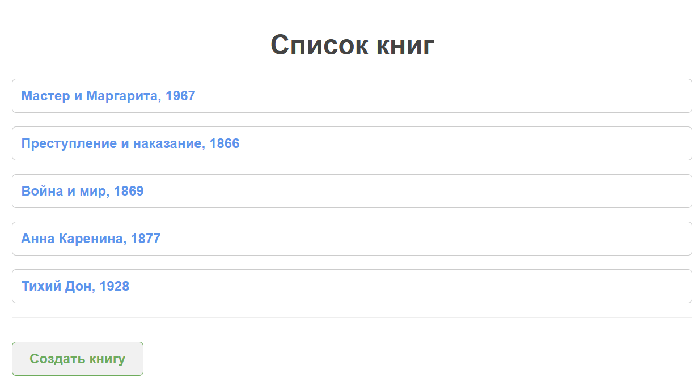
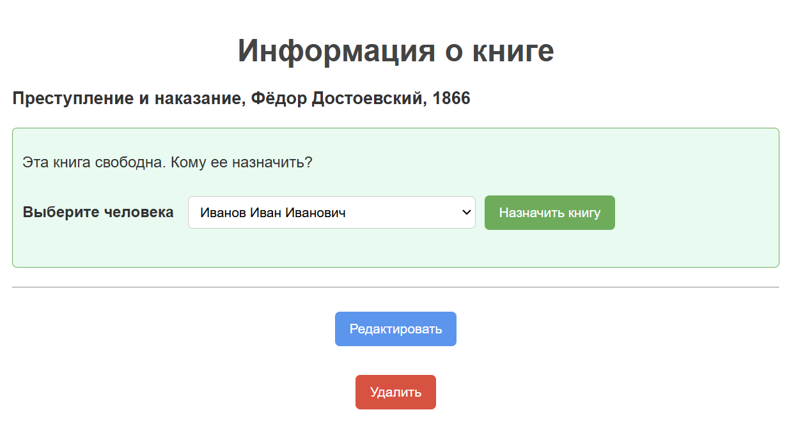

# Библиотечная система

## Описание проекта

В этом проекте реализована библиотечная система с использованием **Spring Framework** и **JDBC Template** для работы с базой данных. Система включает функционал для работы с людьми (пользователями) и книгами, а также возможность назначать книги пользователям и освобождать книги по мере их возвращения.

 

## Стек технологий

- **Spring Framework** — используется для создания веб-приложений и обработки запросов. В этом проекте реализованы страницы для добавления, изменения и удаления как людей, так и книг, а также страницы для отображения всех людей и книг.
- **JDBC Template** — используется для взаимодействия с базой данных. Через JDBC Template происходит выполнение SQL-запросов для добавления, изменения и удаления записей в таблицах Person и Book.
- **Thymeleaf** — шаблонизатор для создания HTML-страниц, использованный для динамического отображения информации на веб-страницах.
- **Spring Validation** — используется для валидации введенных данных на страницах добавления и изменения людей и книг с использованием аннотаций `@Valid` и **Spring Validator**.

## Основной функционал

- **Страницы добавления, изменения и удаления человека**.
- **Страницы добавления, изменения и удаления книги**.
- **Страница со списком всех людей**.
- **Страница со списком всех книг**.
- **Страница человека**.
- **Страница книги**.
- **Кнопка "Освободить книгу" на странице книги**.
- **Выпадающий список на странице книги для назначения книги**.

## Запуск проекта

1. Клонируйте репозиторий:

   ```git clone https://github.com/yourusername/library-system.git```

2. Настройка конфигурации базы данных

**Скопируйте файл `database.properties.example` в новый файл: с именем `database.properties`**

